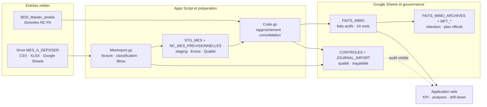

# Architecture et flux de données

**État observé :** 27/08/2026  
**Périmètre :** PA STR, machines de perçage  
**Diagramme visuel :** [ouvrir le diagramme autonome](ARCHITECTURE-DATA-FLOW.html)

Ce document décrit l’architecture actuelle du Dashboard Pilote Machine PA. Le fichier HTML est volontairement indépendant de `Index.html` : il peut être ouvert, imprimé ou partagé comme support d’architecture sans charger l’application.

## Vue éditable

La vue Mermaid est une représentation de maintenance. La composition précise, les responsabilités et les contraintes de lecture sont portées par le diagramme autonome.

## Flux exact

1. **Sources métier.** `BDD_Master_amélio` fournit l’identité IMMO, la famille, la catégorie, la section et les attributs machine. `Remontées aléas production` alimente les aléas. `Données NC PA` est la source NC active et historique.
2. **Dépôt MES.** Un export CSV, XLSX ou Google Sheets est déposé dans `MES_A_DEPOSER`. Les fichiers traités sont destinés au sous-dossier `Archives` et leur résultat est inscrit dans `JOURNAL_IMPORT`.
3. **Import et classification.** `MesImport.gs` détecte la ligne d’en-tête, lit le fichier, filtre les statuts `Supprimé` et `Rejeté`, puis classe les lignes du nouvel export `Structure PA A350` : `03-Moyens / 0328 UPA MEDU` devient `ALEA_MES`, `01-Matière / 0111 Articles Composants Pieces` devient `NC`.
4. **Staging et validation.** Les lignes normalisées sont conservées dans `STG_MES`. Les lignes MES classées NC sont copiées dans `NC_MES_PREVISIONNELLES` pour la recherche SAP et les compléments d’Enora, puis le contrôle Qualité peut renseigner une décision.
5. **Consolidation.** `Code.gs` lit les sources et le staging, rapproche les identités par IMMO ou famille master, applique le périmètre PA/Perçage, calcule les quantités, durées, coûts facultatifs et poids, puis déduplique les faits.
6. **Stockage analytique.** `FAITS_IMMO` contient les faits actifs sur 24 mois. Les faits plus anciens vont dans `FAITS_IMMO_ARCHIVES`. `CONTROLES` regroupe les anomalies et `JOURNAL_IMPORT` conserve l’historique des imports.
7. **Plan MFT.** Les tables `MFT_ACTIONS_OFFICIEL`, `MFT_SUIVI_OFFICIEL` et `MFT_REUNIONS_OFFICIEL` vivent dans le classeur MFT configuré. Elles sont normalisées et indépendantes des anciens onglets de réunion après migration.
8. **Restitution.** `Index.html` appelle les fonctions de lecture Apps Script pour afficher les KPI, les graphiques, l’audit indépendant **Qualité données**, les historiques et les détails filtrés. Le Pilotage conserve les alertes de tendance et le temps perdu par famille ; il ne porte plus le tableau d’audit source.

## Règles de responsabilité

| Zone | Responsable logique | Écriture principale | Lecture principale |
| --- | --- | --- | --- |
| Sources métier | équipes productrices | hors dashboard | `readRecords_` |
| Import MES | Apps Script | `STG_MES`, `NC_MES_PREVISIONNELLES`, `JOURNAL_IMPORT` | fichiers Drive |
| Validation NC | Enora puis Qualité | colonnes workflow de `NC_MES_PREVISIONNELLES` | file par statut |
| Consolidation | Apps Script | `FAITS_IMMO`, `CONTROLES`, archives | sources et staging |
| MFT officiel | administration / pilote MFT | tables `MFT_*` | plan normalisé |
| Pilotage | utilisateurs autorisés | aucune donnée métier directe | `FAITS_IMMO`, `CONTROLES` |

## Frontières et limites auditées

- La frontière d’exécution est Google Apps Script. Le manifeste utilise `access: DOMAIN` et `executeAs: USER_DEPLOYING` ; l’identité de l’utilisateur appelant n’est donc pas une autorisation suffisante pour les écritures.
- Le rapprochement MES peut proposer un IMMO ou une famille depuis `Commentaire initial`. Une proposition textuelle ne doit pas être confondue avec une validation métier.
- L’audit source conserve les lignes exclues dans son dénominateur et distingue IMMO absent, IMMO non résolu, famille héritée du master et date invalide.
- Un pic MES est conservé et signalé sur un axe dédié. Son diagnostic doit pouvoir relier semaine, fichier source, ID fichier, événement, quantité, IMMO, famille et méthode de rapprochement.
- La source `Données NC PA` reste la source NC effective dans l’état audité. La fonction `validatedMesPreNcRows_` existe, mais `actualiserToutUnlocked_` exclut encore les lignes `SOURCE = NC` du staging MES avant consolidation.
- Le flux de rétention et les écritures de tables sont sérialisés par verrou Apps Script, mais les lectures web ne disposent pas d’un snapshot transactionnel explicite pendant la réécriture.

## Points de code de référence

- [manifeste Apps Script](../../apps-script/appsscript.json)
- [orchestration de l’actualisation](../../apps-script/Code.gs#L88)
- [consolidation MES](../../apps-script/Code.gs#L1173)
- [écriture des faits](../../apps-script/Code.gs#L1283)
- [lecture des sources](../../apps-script/Code.gs#L1430)
- [import et déplacement Drive](../../apps-script/MesImport.gs#L51)
- [workflow des NC validées](../../apps-script/MesImport.gs#L426)
- [référentiel MFT normalisé](../../apps-script/MftRepository.gs#L257)
