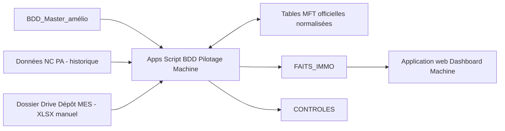

# Dashboard Machine sur Google Drive et Apps Script

Cette solution ne dépend pas de Looker Studio. Le dashboard est une **application web Apps Script** publiée avec une URL interne à votre entreprise.

Le périmètre est exclusivement la **Pointe Avant Structure (PA STR)** pour les machines de perçage. Les faits sont rattachés à un IMMO du master dont `Catégorie = Perçage`, sauf les NC historiques sans IMMO qui disposent d’un nom de machine, d’un poste ou d’une indication famille : elles sont conservées sans être artificiellement rapprochées à un IMMO. Les objets non machine, comme une bonbonne, ne sont pas comptés comme machines. Le master distingue PA de TC ; la nouvelle base MES/NC verrouille désormais le périmètre avec `Unité = Structure PA A350`. Les lignes TC et les autres unités sont exclues. Les événements `01-Matière / 0111 Articles Composants Pieces` alimentent les NC, tandis que `03-Moyens / 0328 UPA MEDU` alimente les aléas MES.

## 1. Architecture recommandée

Le nouveau classeur Google Sheets est nommé `BDD Pilotage Machine`. Ne transformez pas le classeur métier existant en dashboard : il doit rester une source stable.



Le même fichier Google Sheets peut contenir le master, les aléas et l’ancienne feuille NC de secours. Dans ce cas, les paramètres `ID_FICHIER_MASTER`, `ID_FICHIER_ALEAS` et `ID_FICHIER_NC` auront la même valeur. La nouvelle base MES/NC est déposée manuellement dans le dossier Drive prévu à cet effet.

### Pourquoi un classeur central séparé ?

- Les utilisateurs continuent à saisir leurs données dans les feuilles habituelles.
- Le script ne modifie jamais les sources.
- Les calculs techniques ne surchargent pas le classeur métier.
- Les droits du site et des feuilles sources peuvent être gérés séparément.
- Une erreur du dashboard ne bloque pas la production.

Une macro enregistrée n’est pas adaptée : elle rejoue des clics. Apps Script sait lire plusieurs fichiers, contrôler les IMMO, importer les exports MES, planifier l’actualisation et publier un site.

## 2. Préparer Google Drive

Dans un dossier partagé adapté aux données de production, créez :

```text
Dashboard Machine/
  Sources/
  MES_A_DEPOSER/
    Archives/
  BDD Pilotage Machine (Google Sheets)
```

1. Chargez le classeur contenant le master et les NC dans `Sources` (les remontées aléas production ne sont plus utilisées).
2. Dans Drive, faites un clic droit, puis **Ouvrir avec > Google Sheets**.
3. Utilisez **Fichier > Enregistrer au format Google Sheets** si Drive ne l’a pas déjà converti.
4. Vérifiez la présence exacte de `BDD_Master_amélio` et `Données NC PA`.
5. Créez un classeur Google Sheets vide nommé `BDD Pilotage Machine`.

Ne renommez pas les feuilles sources historiques. Le script essaie d’abord leurs noms exacts, puis tolère les espaces accidentels en début ou fin de nom. Dans le fichier local analysé, la feuille porte précisément le nom ` BDD_Master_amélio`, avec un espace initial ; cette variation est prise en charge. La feuille `Données NC PA` reste la source historique des NC, avec l’IMMO lorsqu’il existe et le poste ou nom de machine lorsqu’il est renseigné ; elle demeure obligatoire dans le contrat analytique actuel. Les NC MES validées sont conservées dans la file de préparation et ne sont pas encore intégrées.

## 3. Installer le projet Apps Script

1. Ouvrez `BDD Pilotage Machine`.
2. Ouvrez **Extensions > Apps Script**.
3. Renommez le projet `Dashboard Machine`.
4. Créez ou renommez les fichiers pour obtenir exactement :

```text
Config.gs
Code.gs
MftRepository.gs
MesImport.gs
Index.html
appsscript.json
```

5. Copiez le contenu des fichiers du dossier local [apps-script](apps-script) vers les fichiers du même nom dans Apps Script.
6. Pour afficher `appsscript.json`, ouvrez **Paramètres du projet**, puis activez **Afficher le fichier manifeste appsscript.json dans l’éditeur**.
7. Enregistrez le projet.

Le manifeste active le service avancé Google Drive, utilisé uniquement pour convertir temporairement un export XLSX MES. Un CSV ne nécessite pas cette conversion.

## 4. Initialiser le classeur central

1. Dans la liste des fonctions de l’éditeur, sélectionnez `initialiserApplication`.
2. Cliquez sur **Exécuter**.
3. À la première exécution, cliquez sur **Examiner les autorisations**.
4. Choisissez votre compte professionnel et autorisez l’accès demandé.
5. Revenez dans `BDD Pilotage Machine`, puis actualisez la page.

Le menu **Dashboard Machine** apparaît. Le script crée :

Les commandes d’usage courant sont affichées directement dans ce menu ; les opérations de configuration, de maintenance et d’automatisation sont regroupées dans des sous-menus.

| Onglet | Rôle |
|---|---|
| `PARAMETRES` | Identifiants Drive, coûts moyens et poids d’impact |
| `FAITS_IMMO` | Table consolidée consommée par le site |
| `FAITS_IMMO_ARCHIVES` | Faits de plus de 24 mois, conservés hors des analyses courantes |
| `CONTROLES` | IMMO inconnus, dates ou familles manquantes, doublons master |
| `STG_MES` | Historique normalisé des extractions MES |
| `NC_MES_PREVISIONNELLES` | Tickets MES classés NC, complétés lors de la préparation puis validés par la Qualité |
| `JOURNAL_IMPORT` | Fichiers MES réussis ou en erreur |
| `ACTIONS_MFT` | Ancienne table locale, lue uniquement lors d’une migration si elle existe déjà |

Ne saisissez rien manuellement dans `STG_MES` ni dans les autres onglets techniques. `NC_MES_PREVISIONNELLES` fait exception : ses colonnes de saisie de préparation et de Qualité sont prévues pour être complétées manuellement. Une ancienne feuille `ACTIONS_MFT` doit seulement être conservée jusqu’à la première migration réussie.

## 5. Renseigner les identifiants

Dans l’URL d’un fichier Sheets, l’identifiant est entre `/d/` et `/edit` :

```text
https://docs.google.com/spreadsheets/d/1AbCdEfGhIjKlMnOpQrStUvWxYz/edit
                                      ^^^^^^^^^^^^^^^^^^^^^^^^^^
```

Dans l’URL d’un dossier Drive, l’identifiant est après `/folders/` :

```text
https://drive.google.com/drive/folders/9XyZaBcDeFgHiJk
                                       ^^^^^^^^^^^^^^^
```

Dans **Apps Script > Paramètres du projet > Propriétés du script**, créez les propriétés suivantes. Les IDs aléas, NC, planning MSN, perçage, Doc&Martin et les deux plans d’action TC sont proposés par défaut dans `Config.gs` ; les propriétés du script déjà enregistrées restent prioritaires. Les IDs master et dossiers Drive ne sont pas fournis par défaut.

| Clé | Valeur attendue |
|---|---|
| `ID_FICHIER_MASTER` | ID du fichier contenant `BDD_Master_amélio` |
| `ID_FICHIER_NC` | ID du fichier contenant `Données NC TC`, utilisé pour les NC historiques et leur enrichissement |
| `ID_FICHIER_PLANNING_MSN` | ID du planning mensuel MSN PA STR |
| `ID_FICHIER_TAUX_PERCAGE` | ID du TCD de perçages par famille |
| `ID_FICHIER_DOC_MARTIN` | ID du classeur Doc&Martin, onglet `Tables BDD SAP` (`N° IMMO`, `Famille`, `Equipement`) |
| `ID_FICHIER_PLAN_ACTIONS_MFT` | ID du classeur officiel « Plan actions aléas machines PA » |
| `ID_FICHIER_PLAN_ACTIONS_TC_370` | ID du plan « Plan actions aléas machines 370 2026 » |
| `ID_FICHIER_PLAN_ACTIONS_TC_355_360_OSW` | ID du plan « Plan actions aléas machines 355/360/OSW 2026 » |
| `ID_DOSSIER_MES_A_DEPOSER` | ID du dossier `MES_A_DEPOSER` |
| `ID_DOSSIER_MES_ARCHIVES` | ID du dossier `Archives`, facultatif |
| `COUT_HEURE_PERDUE_EUR` | Coût horaire du temps perdu, facultatif et prioritaire sur les coûts moyens |

Lors de la première exécution de `initialiserApplication`, les valeurs déjà présentes dans un ancien onglet `PARAMETRES` sont migrées automatiquement vers les propriétés du script, puis retirées de cet onglet. Les identifiants `MASTER`, `ALEAS` et `NC` sont aussi détectés automatiquement lorsque les feuilles source sont dans le classeur central. Pour corriger les cinq IDs connus sur un projet déjà initialisé, exécutez **Dashboard Machine > Configuration et maintenance > Synchroniser les IDs des sources connues**. Cette commande ne touche pas au master ni au MFT, invalide le cache analytique et affiche la fin de leurs IDs pour les comparer avec une erreur de connexion. Elle ne reconstruit pas les faits ; lancez ensuite « Actualiser toutes les données » pour convertir les IDs équipement des aléas MES en IMMO/famille. Seuls les équipements liés sans ambiguïté à un IMMO de perçage du master du périmètre sont rapprochés ; une erreur d'accès à Doc&Martin interrompt l'import MES.

Le script recherche automatiquement la bonne feuille dans les classeurs de planning MSN et de perçages par famille.

Pour remplacer un identifiant MFT erroné, ouvrez le classeur central, puis **Dashboard Machine > Configuration et maintenance > Configurer le classeur MFT PA**. Collez l’URL du classeur officiel. Le script vérifie l’accès avant d’enregistrer l’identifiant dans les propriétés du script.

Pour le suivi TC de l’Item 2, le dashboard lit les deux classeurs `ID_FICHIER_PLAN_ACTIONS_TC_370` et `ID_FICHIER_PLAN_ACTIONS_TC_355_360_OSW`, puis sélectionne dans chacun l’onglet MFT historique le plus récent. Une action `En cours` ou `En retard` colore la famille ou l’IMMO en vert doux ; une action `DONE`/`Fait`, reportée ou absente colore en orange pastel ; une source ou une identité non vérifiable reste grise. Le KPI **Coûts non traités** calcule la part des euros NC + MES orange parmi les coûts classifiables, sans additionner deux fois les vues famille et IMMO.

### Dépannage d’un timeout MFT

Si Apps Script affiche `Expiration du délai de connexion au service Feuilles de calcul`, vérifiez d’abord que la propriété `ID_FICHIER_PLAN_ACTIONS_MFT` contient toujours l’identifiant du classeur officiel et que le compte de déploiement peut l’ouvrir directement dans Google Sheets. Le référentiel MFT est ensuite conservé deux minutes en cache pour éviter de rouvrir le classeur à chaque appel du dashboard ; une erreur transitoire est réessayée automatiquement trois fois. Un ID incorrect ou un droit manquant doit être corrigé dans les propriétés du script, pas dans le code.

## 5 bis. Référentiel MFT et plan d’actions officiel

La page **Revue MFT** n’est pas exposée dans l’interface pour le moment. Le classeur référencé par la propriété `ID_FICHIER_PLAN_ACTIONS_MFT` reste le référentiel officiel pour les opérations d’administration. Il ne dépend plus du nom, de la mise en forme ni de la duplication des feuilles de réunion.

Lors de la première initialisation, le script crée dans ce classeur trois tables inspirées du fichier historique :

| Table officielle | Granularité | Contenu principal |
|---|---|---|
| `MFT_ACTIONS_OFFICIEL` | Une ligne par action | Réf., demandeur, constat, action décidée, responsables, échéance initiale, statut, priorité, IMMO/famille |
| `MFT_SUIVI_OFFICIEL` | Une ligne par mise à jour | Date, commentaire, changement de statut, nouvelle date promise, auteur |
| `MFT_REUNIONS_OFFICIEL` | Une ligne par réunion | Date, prochaine réunion, participants et compteurs historiques |

Le menu **Dashboard Machine > Initialiser / migrer la table MFT officielle** importe de manière idempotente l’état courant depuis le dernier ancien onglet `MFT ALEAS MACHINES PA JJMMAAAA`, conserve son commentaire cumulé comme suivi historique et enregistre les anciens onglets dans le registre des réunions. Une ancienne action créée dans `ACTIONS_MFT` est également reprise. Après cette migration, le dashboard lit et écrit uniquement les trois tables normalisées ; les feuilles copiées peuvent être conservées comme archives sans influencer l’application.

L’échéance initiale n’est jamais remplacée lorsqu’elle est dépassée. Toute révision est enregistrée dans `MFT_SUIVI_OFFICIEL` comme **nouvelle date promise**, conformément aux instructions du plan d’action d’origine. Le statut « En retard » est calculé automatiquement pour une action ouverte dont la date effective est dépassée.

Le propriétaire du déploiement doit avoir le droit de modifier le classeur officiel. Le bouton d’impression (icône imprimante) génère un PDF propre du plan officiel, sans le formulaire.

Si l’ID d’archives reste vide, le script crée ou réutilise automatiquement un sous-dossier `Archives`.

## 5 ter. Valider les NC préremplies

Après l’import MES, ouvrez `NC_MES_PREVISIONNELLES` dans le classeur central. Les colonnes importées sont conservées par le script ; la préparation qualité complète uniquement :

| Colonne | Saisie par | Rôle |
|---|---|---|
| `NC_NUMERO` | MES ou préparation qualité | Numéro de NC à copier-coller dans SAP pour retrouver l’IMMO ou la famille |
| `IMMO_SAISI` | Préparation qualité | IMMO confirmé ou corrigé |
| `FAMILLE_SAISIE` | Préparation qualité | Famille lorsqu’aucun IMMO fiable n’est disponible |
| `COMMENTAIRE_PREPARATION` | Préparation qualité | Précision utile à la validation |
| `STATUT_WORKFLOW` | Script | État de traitement |
| `DECISION_QUALITE` | Qualité | `VALIDEE`, `A_CORRIGER` ou `REJETEE` |
| `COMMENTAIRE_QUALITE` | Qualité | Motif ou demande de correction |

Le circuit est le suivant :

Les actions de préparation et de contrôle sont séparées pour que chaque personne dispose d’un accès simple à son étape.

### Étapes de préparation

1. Dans la barre du classeur, ouvrir **NC Qualité - Préparation > 1. Ouvrir les NC à compléter**. Les lignes `A_COMPLETER` et `A_CORRIGER` sont affichées.
2. Copier la valeur de `NC_NUMERO` et la coller dans SAP pour retrouver l’IMMO ou la famille.
3. Reporter le résultat dans `IMMO_SAISI` ou `FAMILLE_SAISIE`. Ajouter une précision dans `COMMENTAIRE_PREPARATION` si nécessaire.
4. Sélectionner les lignes complétées. Ne pas sélectionner la ligne d’en-tête.
5. Ouvrir **NC Qualité - Préparation > 2. Soumettre les lignes sélectionnées**. Le statut devient `SOUMIS`.

### Étapes de contrôle Qualité

1. Ouvrir **NC Qualité > 1. Ouvrir les NC soumises**. Seules les lignes `SOUMIS` sont affichées.
2. Contrôler l’IMMO, la famille, le poste, la typologie et les commentaires.
3. Renseigner `DECISION_QUALITE` : `VALIDEE`, `A_CORRIGER` ou `REJETEE`. Ajouter `COMMENTAIRE_QUALITE` pour justifier la décision ou demander une correction.
4. Sélectionner les lignes contrôlées. Ne pas sélectionner la ligne d’en-tête.
5. Ouvrir **NC Qualité > 2. Enregistrer les décisions**. La date et l’utilisateur sont enregistrés automatiquement.
6. Ouvrir **NC Qualité > 3. Actualiser après validation**. Les lignes `VALIDEE` restent dans la file de préparation et n’alimentent pas encore `FAITS_IMMO` ni **Analyses NC TC** ; les lignes `A_CORRIGER` redeviennent visibles pour la préparation qualité.

Les dates et utilisateurs de soumission/validation sont enregistrés automatiquement. Les imports ultérieurs mettent à jour les données MES par `ID_EVENEMENT` sans écraser les saisies manuelles. Une NC validée peut entrer dans les faits même sans `N° NC` officiel ; son identifiant MES sert alors de clé technique jusqu’à un rapprochement ultérieur.

Deux menus séparés sont disponibles dans la barre du classeur :

- **NC Qualité - Préparation** affiche les lignes `A_COMPLETER` et `A_CORRIGER`, puis permet de soumettre la sélection ;
- **NC Qualité** affiche les lignes `SOUMIS`, permet d’enregistrer les décisions et propose l’actualisation après validation.

Le menu **Dashboard Machine** est réservé aux opérations d’administration et de maintenance. La préparation et la Qualité n’ont donc pas besoin d’utiliser ses autres commandes.

## 6. Coûts et priorité des NC

Les coûts et l’indice d’impact sont volontairement séparés.

- `POIDS_ALEA = 1`
- `POIDS_NC = 5`
- `POIDS_ALEA_MES = 1`

Ces poids font remonter les NC dans les priorités. Ils ne représentent pas des euros et peuvent être modifiés après validation métier.

L’**indice d’impact** est la somme `quantité × poids source`. Avec les valeurs par défaut : `aléas production × 1 + NC × 5 + aléas MES × 1`. C’est un score de priorisation en points, pas un coût, une gravité certifiée ni un pourcentage. Le « Top des défauts machines » utilise comme axe Y `Aléa` pour la production, `Typologie défaut` pour les NC et `Attribut` pour MES ; l’axe X est cet indice pondéré. Le dashboard additionne désormais le `Temps aléas`/`Temps perdu` des aléas production, des NC et des aléas MES, puis le restitue par défaut et par IMMO PA.

Les durées sont stockées en heures décimales pour les calculs : `0,50 h` correspond à `00:30:00`, `1,50 h` à `01:30:00`. Lors d’un import Google Sheets ou XLSX, le script lit le format affiché de la cellule `Temps aléas` afin de convertir correctement les fractions de journée.

Laissez ces paramètres vides tant qu’un coût moyen fiable n’a pas été validé :

- `COUT_MOYEN_ALEA_EUR`
- `COUT_MOYEN_NC_EUR`
- `COUT_MOYEN_ALEA_MES_EUR`
- `COUT_HEURE_PERDUE_EUR` (facultatif, prioritaire si un coût horaire de temps perdu est validé)

Sans coût horaire, le site utilise les coûts moyens par source : si une NC coûte en moyenne 900 € et un aléa 120 €, saisissez `900` et `120`, sans symbole euro. Si `COUT_HEURE_PERDUE_EUR` est renseigné, le coût estimé devient `Temps perdu en heures × coût horaire` pour les aléas, NC et MES. Le site affiche alors le coût estimé et son taux de couverture.

## 7. Premier chargement

1. Dans `BDD Pilotage Machine`, ouvrez **Dashboard Machine > Actualiser toutes les données**.
2. Attendez le message indiquant le nombre d’événements actifs et les nouveaux faits archivés. Les faits datés de plus de 24 mois sont déplacés de `FAITS_IMMO` vers `FAITS_IMMO_ARCHIVES` ; les faits sans date restent actifs pour ne pas les masquer silencieusement.
3. Ouvrez `CONTROLES`.
4. Corrigez en priorité :

| Contrôle | Signification |
|---|---|
| `IMMO_ABSENT_MASTER` | L’IMMO de l’événement n’est pas dans le master |
| `DOUBLON_MASTER` | Le master contient plusieurs lignes pour le même IMMO |
| `DATE_MANQUANTE` | L’événement ne peut pas être placé dans la tendance |
| `FAMILLE_MANQUANTE` | Ni la source ni le master ne donnent de famille |
| `IMMO_MASTER_INVALIDE` | Valeur non exploitable dans la colonne IMMO du master (`DOTATION`, `A ENQUETER`, etc.), volontairement exclue |
| `RAPPROCHEMENT_MES_A_VERIFIER` | Plusieurs IMMO ou une famille partielle ont été déduits du commentaire MES |

Pour MES, le rapprochement commence par `ID équipement` lorsqu’il est renseigné : sa valeur est recherchée dans la colonne `Equipement` du master afin de récupérer le `N° IMMO` et la famille. Si l’ID équipement manque ou reste ambigu, le script continue avec l’IMMO et la famille éventuellement présents, puis recherche un IMMO ou une famille dans le commentaire initial. Une NC historique sans IMMO mais avec une famille, un poste ou un nom de machine source est conservée comme fait non rattaché ; elle est comptée dans les volumes et familles, mais pas dans les Pareto IMMO ni la couverture master. Les NC préremplies suivent ensuite le workflow de validation décrit à la section 5 ter.

## 7.1 Rétention des faits

Le dashboard lit uniquement les **24 derniers mois** dans `FAITS_IMMO`, ce qui réduit le temps de chargement des KPI et graphiques. Les données plus anciennes sont conservées avec leur date d’archivage dans `FAITS_IMMO_ARCHIVES` et ne sont jamais supprimées par le script. La commande **Dashboard Machine > Archiver les faits de plus de 24 mois** permet d’appliquer cette règle sans relire les sources ; l’actualisation complète l’applique automatiquement.

Pour le Pareto familles, une famille NC explicitement renseignée dans la source est conservée ; à défaut, la famille du master complète le fait. Une valeur d’objet comme `0328 UPA MEDU`, un article ou un consommable ne peut jamais devenir une famille machine. Une NC sans IMMO mais avec une famille, un nom de machine ou un poste source reste visible dans les volumes, le Pareto familles, le poste et le détail ; elle n’apparaît pas dans le Pareto IMMO et n’est pas comptée dans la couverture master.

Lorsqu’une cellule contient plusieurs IMMO séparés par `/`, le script crée une ligne par IMMO unique et enrichit chaque machine séparément depuis le master. Les valeurs vides et les doublons internes sont supprimés. Une NC associée à trois IMMO produit donc trois impacts machine dans le dashboard ; les indicateurs représentent des impacts par machine et non le nombre distinct de déclarations NC. Si un coût moyen est configuré, il est réparti à parts égales entre les IMMO afin que le coût total de la déclaration ne soit pas multiplié.

## 8. Gérer les extractions manuelles MES

Vous n’avez pas besoin de créer un nouveau classeur pour chaque extraction. Il n’existe pas de fichier MES préchargé : le fichier est l’extraction CSV ou XLSX que vous produisez manuellement depuis le MES.

### Créer le dossier la première fois

1. Dans `BDD Pilotage Machine`, ouvrez **Dashboard Machine > Créer le dossier de dépôt MES**.
2. Acceptez l’autorisation Google Drive si elle est demandée.
3. Le script crée dans `Mon Drive` le dossier `MES_A_DEPOSER - Dashboard Machine PA` et son sous-dossier `Archives`.
4. Dans Google Drive, partagez `MES_A_DEPOSER - Dashboard Machine PA` avec les personnes chargées des extractions en leur donnant le rôle **Éditeur**.
5. Vous pouvez déplacer ce dossier dans votre dossier partagé `Dashboard Machine` : son identifiant ne change pas.
6. Les identifiants des dossiers sont automatiquement écrits dans `PARAMETRES`.
7. Dans le site, actualisez la page : l’encart **Extraction MES** affiche alors le bouton **Ouvrir MES_A_DEPOSER - Dashboard Machine PA**.

Le petit bouton d’import du site crée également le dossier s’il n’est pas encore configuré.

### Déposer et importer une extraction

1. Dans le MES, exportez la période au format CSV ou XLSX.
2. Dans le site, cliquez sur **Ouvrir MES_A_DEPOSER - Dashboard Machine PA**.
3. Dans Google Drive, cliquez sur **Nouveau > Importer un fichier**, puis sélectionnez l’extraction.
4. Revenez au site et cliquez sur le petit bouton d’import à droite du lien, ou lancez **Dashboard Machine > Actualiser toutes les données** dans le classeur.
5. Après un import réussi, le fichier est déplacé dans `Archives` et ses lignes alimentent le dashboard.

Après une évolution des règles de reconnaissance IMMO/famille, utilisez **Dashboard Machine > Reconstruire l’historique MES**. La commande relit directement tous les CSV/XLSX du dossier `Archives`, remplace `STG_MES`, puis reconsolide les faits. Elle rapproche d’abord `ID équipement` avec la colonne `Equipement` du master, puis reconnaît les IMMO et familles écrits dans `Commentaire initial`, y compris avec des espaces, tirets ou libellés partiels non ambigus.
6. Vérifiez si nécessaire que `JOURNAL_IMPORT` affiche `SUCCES`.

Le site s’ouvre par défaut sur les **21 derniers jours**. Les boutons `3 sem.`, `3 mois` et `Tout`, ainsi que les deux dates libres, pilotent tous les KPIs et graphiques.

Le modèle d’en-tête recommandé est :

```csv
Date;IMMO;Famille;Type de machine;Section;Poste;Categorie Alea;Alea;Quantite;ID
20/08/2026;1710288;401-M2-008-A-P2-3.2;CE;PA;370;Machine;Compteur illisible;1;MES-EXEMPLE-001
```

Les colonnes minimales sont `Date` et `IMMO`. Pour un dashboard utile, fournissez aussi `Alea` ou `Description`.

### Nouvelle base MES / NC réellement prise en charge

Le fichier local [79418004-4a1c-4410-bb95-82f0a1ab2453.xlsx](../data/samples/79418004-4a1c-4410-bb95-82f0a1ab2453.xlsx) correspond à l’export MES réel analysé. Il peut être déposé manuellement au format XLSX, sans renommer ses colonnes. Un seul fichier contient les événements MES et les NC ; le script les sépare lors de l’import.

| Colonne | Utilisation dans le dashboard |
|---|---|
| `ID ticket` | Identifiant unique de l’événement |
| `Date d'ouverture` | Date et semaine du défaut |
| `Temps aléas` | Durée perdue, convertie en heures |
| `5M` | Classification principale du défaut |
| `Objet` | Classification détaillée utilisée avec `5M` |
| `Attribut` | Libellé du défaut affiché dans les Pareto |
| `N° NC` | Numéro de NC copié dans `NC_MES_PREVISIONNELLES` pour la recherche SAP |
| `Unité` | Périmètre strict : seule `Structure PA A350` est conservée |
| `Poste / MFT` | Poste de rattachement |
| `Commentaire MES` | Commentaire utilisé pour proposer un IMMO/famille |
| `ID équipement`, `Jigs and Tools`, `Matériel` | Identité machine éventuelle |
| `MSN_MES` | MSN conservé dans les faits |

Les règles métier de la nouvelle base sont strictes :

- `03-Moyens` + `0328 UPA MEDU` + `Structure PA A350` devient la source `ALEA_MES` ;
- `01-Matière` + `0111 Articles Composants Pieces` + `Structure PA A350` devient la source `NC` ;
- les autres combinaisons `5M`/`Objet`, ainsi que les autres unités, sont exclues ;
- `Temps aléas` est conservé pour les NC comme pour les aléas MES et alimente les heures perdues machine PA ;
- les NC importées reçoivent `NB_NC = 1` lorsqu’aucun compteur séparé n’est fourni ;
- les lignes `Données NC PA` sont la source NC du dashboard ; les NC MES sont conservées dans `NC_MES_PREVISIONNELLES` pour fiabilisation et ne sont pas encore intégrées aux faits ;
- toutes les lignes MES classées NC sont écrites dans `NC_MES_PREVISIONNELLES`, avec la valeur de la colonne `N° NC` lorsqu’elle est disponible. Elles ne sont pas ajoutées aux faits NC, y compris après validation, tant que le flux MES NC n’est pas déclaré fiable ; les statuts `Supprimé` et `Rejeté`, ainsi que les libellés explicitement sans NC, sont exclus de cette feuille ;
- l’import reste manuel via le dossier Drive, et **Reconstruire l’historique MES** doit être lancé après un changement de règle.

Le site s’ouvre par défaut sur une année glissante. Le bouton **Tout** conserve les faits actifs, soit les deux dernières années ; les faits plus anciens sont stockés dans `FAITS_IMMO_ARCHIVES`. Les résultats du tableau de bord, des analyses Aléas/NC et des détails sont mis en cache pendant 15 minutes. Le cache est automatiquement invalidé après **Actualiser toutes les données**.

Après une modification des règles d’import ou des alias MES, déployez les fichiers Apps Script puis lancez **Reconstruire l’historique MES** ; cette commande relit les exports et relance déjà l’actualisation. Cette opération est volontairement plus longue car elle relit les exports MES ; les consultations suivantes utilisent le cache. Le redimensionnement automatique de `FAITS_IMMO` n’est plus exécuté à chaque actualisation afin de réduire le temps de traitement.

Le nouveau fichier contient 104 261 lignes. Sur l’unité `Structure PA A350`, 219 lignes correspondent aux aléas `0328 UPA MEDU` et 8 339 lignes aux NC `0111 Articles Composants Pieces`. Le reste des lignes PA correspond à d’autres objets et n’alimente pas ces deux sources.

Le script reconnaît aussi les anciens formats génériques et Qlik (`Disruption ID`, `Date ouverture`, `EAP`, `Temps perdu`) afin de préserver la compatibilité des imports archivés.

### Planning MSN et taux de perçage

Ces deux fichiers sont des référentiels, pas des événements supplémentaires.

- `Impacts/MSN` utilise la ligne `A350 Structure PA` / `PA STR` du planning. La valeur mensuelle est proratisée sur les jours de la période sélectionnée.
- `Impacts / 1 000 perçages` rapproche uniquement les familles du master avec la colonne `Famille` du TCD, puis utilise `Total général` comme dénominateur.
- Cette valeur est un **nombre d’impacts pour 1 000 perçages**, jamais un pourcentage.
- Sur le TCD analysé, 77 des 94 libellés exploitables correspondent à une famille du master. Les autres sont principalement des forets, consommables ou familles absentes et sont ignorés.
- Une période planning absente ou une famille sans volume de perçage produit une valeur indisponible, jamais un faux zéro.

Le TCD fourni est cumulatif et ne contient pas de date. Le taux compare donc les impacts de la période filtrée à cette base cumulée. Pour obtenir un taux strict sur trois semaines, fournissez ensuite un TCD de perçages ventilé par semaine ou par date.

### En cas d’erreur d’import

Le fichier reste dans le dossier d’entrée et une ligne `ERREUR` apparaît dans `JOURNAL_IMPORT`. Corrigez le fichier ou les alias, puis relancez. Une ligne `SUCCES` empêche volontairement tout double import du même fichier Drive.

## 9. Publier le site

1. Dans Apps Script, cliquez sur **Déployer > Nouveau déploiement**.
2. Cliquez sur l’engrenage, puis choisissez **Application Web**.
3. Description : `Dashboard Machine - version 1`.
4. **Exécuter en tant que** : `Moi`.
5. **Qui a accès** : votre domaine ou les utilisateurs autorisés par votre politique interne.
6. Cliquez sur **Déployer** et autorisez à nouveau si nécessaire.
7. Ouvrez l’URL se terminant par `/exec`.

Ne choisissez pas un accès public pour des données de production.

Après une modification du code :

1. Ouvrez **Déployer > Gérer les déploiements**.
2. Modifiez le déploiement existant.
3. Sélectionnez **Nouvelle version**.
4. Cliquez sur **Déployer**.

L’URL `/exec` reste identique.

## 10. Automatiser l’actualisation

Dans `BDD Pilotage Machine`, utilisez **Dashboard Machine > Installer l’actualisation automatique**. Le script crée un déclencheur toutes les six heures.

Le propriétaire du script doit conserver l’accès aux sources et aux dossiers MES. Si son compte perd ses droits, le déclencheur ne fonctionnera plus.

## 11. Contrôles de recette

Avant diffusion, vérifiez :

1. Un IMMO connu récupère la bonne famille.
2. Le nombre d’aléas d’un mois correspond à la source.
3. Le nombre de NC d’un mois provient actuellement des NC historiques `Données NC PA` ; les NC MES validées restent hors des faits analytiques tant que le flux MES NC n’est pas déclaré fiable. Les doublons par `N° NC` ne sont comptés qu’une fois, et les IMMO/postes/familles non vides de l’ancienne base sont conservés.
4. Une extraction MES de test apparaît une seule fois après deux actualisations.
5. Une NC pèse davantage qu’un aléa selon les poids définis.
6. Un IMMO inconnu apparaît dans `CONTROLES`.
7. La recherche Famille avec suggestions, le filtre Source, la recherche IMMO et la période fonctionnent.
8. La vue test **Aléas combinés** affiche les deux sources, conserve les événements sans paire et détaille le score ainsi que les critères de chaque correspondance.
9. Un utilisateur autorisé ouvre l’URL sans accéder à l’éditeur Apps Script.

## 12. Limites à connaître

Apps Script convient à un dashboard interne de taille modérée. Si la table dépasse durablement environ 100 000 à 200 000 événements ou si une actualisation approche la limite de temps Apps Script, il faudra charger les données par lots ou utiliser un stockage analytique. Tant que les volumes restent compatibles, cette architecture reste entièrement dans Google Drive et ne nécessite aucun serveur local.

La vue test **Aléas combinés** est une aide à l’analyse, pas une preuve de causalité ni une consolidation supplémentaire. Elle limite la réponse à 200 lignes et son rapprochement glouton retient une seule meilleure paire par événement selon la date, le poste, l’IMMO et les mots-clés ; les cas à vérifier doivent être revus dans les sources métier.

Le dossier local sert à préparer le code. La publication effective doit être faite depuis votre compte Google professionnel, car l’environnement local ne possède ni vos identifiants Drive ni vos autorisations d’entreprise.
